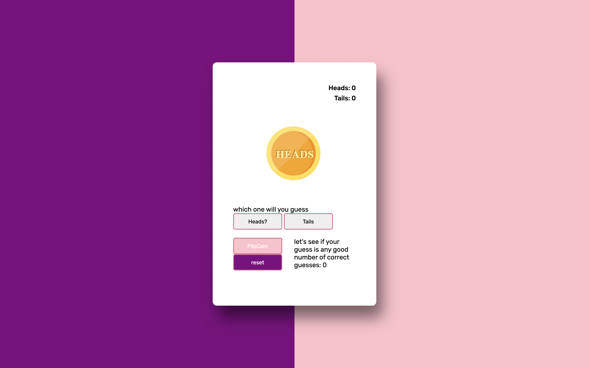

# previous Express (coin flip)

**link to project**

### How It’s Made

Most of it is done with client side javascript, the only thing done server side is the logging of the character number of guesses 

<b>Langs used</b>
Javascript, HTML5, CSS3, express.js and node.js

### optimizations

Some of the bottom button need to be fixed with CSS, just to look good. I think there is a more straightforward way of measuring who one or not. 

### Lessons Learned
When taking client side logic and making it server side, you can put however much logic in the backend, but what matters most is what information you want accessible. 